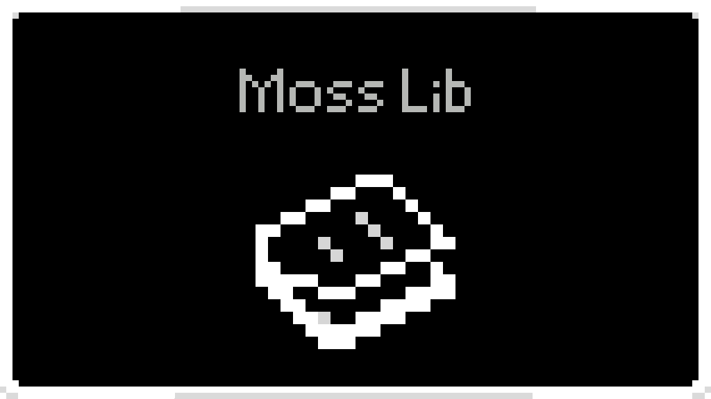

[中文指南](README_ZH.md)

# Moss Lib

[GitHub](https://github.com/Black-Moss/Moss-Lib) / [Nexus Mods](https://www.nexusmods.com/scavprototype/mods/8)

_Just a simple library for [Black_Moss](https://github.com/Black-Moss). :)_

---

## Table of Contents

- [Overview](#overview)
- [Installation](#installation)
- [Quick Start](#quick-start)
- [Localization System](#localization-system)
- [Command System](#command-system)
- [Language Generator](#language-generator)
- [Tools Reference](#tools-reference)
  - [Log](#log)
  - [GameConsole](#gameconsole)
  - [World](#world)
  - [Player](#player)
  - [Multiplayer](#multiplayer)
  - [Config](#config)
  - [Tools (Utils)](#tools-utils)

---

## Overview

**Moss Lib** is a BepInEx plugin library for **Casualties Unknown** (and its demo), providing a set of reusable base classes and utility tools to simplify mod development. It includes:

| Module | Description |
|---|---|
| [`ModLocaleBase`](Base/ModLocaleBase.cs) | Multi-language localization system with JSON-based language files |
| [`ModCommandBase`](Base/ModCommandBase.cs) | Base class for registering custom in-game console commands |
| [`ModLangGenBase`](Base/ModLangGenBase.cs) | Language file generator that produces JSON locale files from code |
| [`Log`](Tool/Log.cs) | Advanced in-game console logging utilities |
| [`GameConsole`](Tool/Console.cs) | Wrapper to execute game console commands programmatically |
| [`World`](Tool/World.cs) | World manipulation: place blocks, items, and background tiles |
| [`Player`](Tool/Player.cs) | Player manipulation: teleport, alerts, inventory management |
| [`Multiplayer`](Tool/Multiplayer.cs) | Multiplayer support with reflection-based KrokoshaCasualtiesMP integration |
| [`Config`](Tool/Config.cs) | BepInEx configuration entry toggling helpers |
| [`Tools`](Tool/Tools.cs) | Argument validation, float/int parsing utilities |

---

## Installation

1. Install [BepInEx 5.x](https://github.com/BepInEx/BepInEx) for Casualties Unknown.
2. Download the latest [`MossLib.dll`](https://github.com/Black-Moss/Moss-Lib/releases) from the Releases page (or [Nexus Mods](https://www.nexusmods.com/scavprototype/mods/8)).
3. Place `MossLib.dll` into your `BepInEx/plugins/` folder.
4. (Optional) For multiplayer features, install **KrokoshaCasualtiesMP** as a soft dependency.

> **For mod developers:** Add a reference to `MossLib.dll` in your project, and add `BepInDependency("blackmoss.mosslib")` to your plugin class.

---

## Quick Start

### 1. Add BepInEx Dependency

```csharp
[BepInPlugin(Guid, Name, Version)]
[BepInDependency("blackmoss.mosslib")]  // Add this line
public class MyPlugin : BaseUnityPlugin
{
    // ...
}
```

### 2. Set Up Localization

```csharp
// Create a locale class (singleton wrapper)
public class MyLocale : ModLocaleBase
{
    private static MyLocale _instance;

    public static void Initialize(ManualLogSource logger)
    {
        _instance = new MyLocale();
        _instance.Initialize(logger, Assembly.GetExecutingAssembly());
    }

    public static string Get(string key) => _instance?.GetString(key) ?? $"[{key}]";
    public static string GetFormat(string key, params object[] args) => _instance?.GetStringFormatted(key, args) ?? $"[{key}]";
}
```

### 3. Register a Custom Command

```csharp
[HarmonyPatch(typeof(ConsoleScript))]
public class MyCommand : ModCommandBase
{
    [HarmonyPatch("RegisterAllCommands")]
    [HarmonyPostfix]
    public static void RegisterCustomCommands(ConsoleScript __instance)
    {
        ConsoleScript.Commands.Add(new Command(
            "mycommand",
            "Description of my command",
            _ => Log.Info("Command executed!", Plugin.Logger),
            null
        ));
    }
}
```

---

## Localization System

The localization system loads JSON language files from the `Lang/` folder inside your plugin directory.

### File Structure

```
BepInEx/plugins/YourPlugin/
├── Lang/
│   ├── EN.json        # English (fallback)
│   ├── zh-CN.json     # Simplified Chinese
│   └── zh-TW.json     # Traditional Chinese
└── YourPlugin.dll
```

### JSON Format

Language files use nested JSON keys with dot notation for organization:

```json
{
    "welcome": "Welcome!",
    "command": {
        "mycommand": {
            "description": "My custom command",
            "text": "Hello {0}!"
        }
    },
    "tool": {
        "player": {
            "bodynull": "Player body is null"
        }
    }
}
```

### API Methods

| Method | Description |
|---|---|
| [`GetString(key)`](Base/ModLocaleBase.cs:116) | Get localized string by key; falls back to English, then returns `[key]` |
| [`GetStringFormatted(key, args...)`](Base/ModLocaleBase.cs:163) | Get localized string and apply `string.Format()` with arguments |
| [`GetStringArray(key)`](Base/ModLocaleBase.cs:149) | Get a localized string array (JSON array) |
| [`GetStringDictionary(key)`](Base/ModLocaleBase.cs:156) | Get a localized dictionary (JSON object) |
| [`HasKey(key)`](Base/ModLocaleBase.cs:245) | Check if a translation key exists |

### Example

See [`Example/ModLocale.cs`](Example/ModLocale.cs) for a complete singleton implementation.

```csharp
// Initialize in plugin Awake()
MyLocale.Initialize(Logger);

// Usage
string welcome = MyLocale.Get("welcome");                          // "Welcome!"
string message = MyLocale.GetFormat("command.mycommand.text", "World"); // "Hello World!"
```

---

## Command System

The command system allows you to register custom console commands via Harmony patching.

### Base Class: [`ModCommandBase`](Base/ModCommandBase.cs)

| Member | Description |
|---|---|
| [`Initialize(logger, assembly, harmony?)`](Base/ModCommandBase.cs:18) | Initialize with logger and plugin assembly; optionally provide Harmony instance |
| [`LogToConsole(text)`](Base/ModCommandBase.cs:52) | Log text to the in-game console |
| [`ApplicationLogCallback(condition, stackTrace, type)`](Base/ModCommandBase.cs:60) | Callback for Unity log messages with color-coded console output |
| [`Logger`](Base/ModCommandBase.cs:95) | Protected `ManualLogSource` property for subclasses |

### Example

```csharp
[HarmonyPatch(typeof(ConsoleScript))]
public class MyCommand : ModCommandBase
{
    [HarmonyPatch("RegisterAllCommands")]
    [HarmonyPostfix]
    public static void RegisterCustomCommands(ConsoleScript __instance)
    {
        ConsoleScript.Commands.Add(new Command(
            "hello",
            "Says hello",
            args => {
                string name = args.Length > 1 ? args[1] : "World";
                LogToConsole($"Hello, {name}!");
            },
            null
        ));
    }
}
```

See [`Example/ModCommand.cs`](Example/ModCommand.cs) for a complete example.

---

## Language Generator

The language generator auto-creates JSON language files from C# code, eliminating the need to manually write and maintain locale JSON files.

### Base Class: [`ModLangGenBase`](Base/ModLangGenBase.cs)

| Member | Description |
|---|---|
| [`LanguageCode`](Base/ModLangGenBase.cs:13) | Abstract property; return the language code (e.g., `"EN"`, `"zh-CN"`) |
| [`BuildLocaleData()`](Base/ModLangGenBase.cs:32) | Abstract method; call `Add()` to register translations |
| [`Add(key, value)`](Base/ModLangGenBase.cs:34) | Add a translation entry |
| [`Generate(outputDirectory?)`](Base/ModLangGenBase.cs:50) | Generate the JSON file; merges with existing files (doesn't overwrite existing entries) |
| [`Count`](Base/ModLangGenBase.cs:206) | Number of registered translation entries |

### Creating a Generator

```csharp
public class EnLangGenerator : ModLangGenBase
{
    protected override string LanguageCode => "EN";

    protected override void BuildLocaleData()
    {
        Add("welcome", "Welcome!");
        Add("command.hello.description", "Says hello");
        Add("command.hello.text", "Hello, {0}!");
    }
}
```

### Registration & Generation

Use [`LocaleGenerator`](Tool/LocaleGenerator.cs) to register and generate all language files:

| Method | Description |
|---|---|
| [`SetLogger(logger)`](Tool/LocaleGenerator.cs:15) | Set the logger |
| [`Register(generator, logger)`](Tool/LocaleGenerator.cs:20) | Register a language generator |
| [`GenerateAll(outputDirectory?)`](Tool/LocaleGenerator.cs:35) | Generate all registered language files |
| [`GenerateSingle(languageCode, outputDirectory?)`](Tool/LocaleGenerator.cs:77) | Generate a single language file |
| [`PrintInfo()`](Tool/LocaleGenerator.cs:102) | Print info about all registered generators |

```csharp
// In plugin Awake()
LocaleGenerator.SetLogger(Logger);
LocaleGenerator.Register(new EnLangGenerator(), Logger);
LocaleGenerator.Register(new ZhCnLangGenerator(), Logger);
LocaleGenerator.GenerateAll(); // Creates EN.json, zh-CN.json in Lang/ folder
```

> **Note:** The generator **merges** with existing JSON files — it only adds **new** entries, preserving any user modifications to existing translations.

---

## Tools Reference

### Log

[`Log`](Tool/Log.cs) — Enhanced in-game console logging with BepInEx integration.

| Method | Description |
|---|---|
| [`LogToConsole(text)`](Tool/Log.cs:22) | Write a message to the in-game console with timestamp |
| [`Info(text, logger)`](Tool/Log.cs:53) | Log to both in-game console and BepInEx log |
| [`Debug(text, logger)`](Tool/Log.cs:59) | Log debug message with `[DEBUG]` prefix |
| [`Error(text, logger)`](Tool/Log.cs:65) | Log error message with `[ERROR]` prefix |
| [`Warning(text, logger)`](Tool/Log.cs:71) | Log warning message with `[WARNING]` prefix |
| [`Alert(text, logger, important, delay?)`](Tool/Log.cs:77) | Log and show a player alert (screen notification) |
| [`NewLine()`](Tool/Log.cs:42) | Insert a blank line in the console |
| [`Divider(char?, length?)`](Tool/Log.cs:47) | Insert a divider line |

### GameConsole

[`GameConsole`](Tool/Console.cs) — Execute game console commands programmatically.

```csharp
// Execute any in-game console command
GameConsole.RunCommand("some_command arg1 arg2");
```

### World

[`World`](Tool/World.cs) — World manipulation tools.

| Method | Description |
|---|---|
| [`PlaceBlock(x, y, block)`](Tool/World.cs:21) | Place a block at tile coordinates |
| [`PlaceBlock(vector2, block)`](Tool/World.cs:26) | Place a block at a Vector2 position |
| [`PlaceItem(x, y, item)`](Tool/World.cs:39) | Spawn an item at tile coordinates |
| [`PlaceItem(vector2, item)`](Tool/World.cs:44) | Spawn an item at a Vector2 position |
| [`PlaceBackground(pos, backgroundId)`](Tool/World.cs:61) | Place a background tile with sprite |
| [`CreateTileMesh(pos)`](Tool/World.cs:113) | Create a tiled mesh for background rendering |
| [`CheckForWorld()`](Tool/World.cs:179) | Throw if no world is loaded |
| [`ClearCache()`](Tool/World.cs:185) | Clear sprite/mesh/material caches |

### Player

[`Player`](Tool/Player.cs) — Player manipulation tools.

| Method | Description |
|---|---|
| [`Alert(text, important)`](Tool/Player.cs:12) | Show a screen alert to the player |
| [`Alert(text, important, delay)`](Tool/Player.cs:22) | Show a delayed screen alert |
| [`Tp(vector2)`](Tool/Player.cs:36) | Teleport the player (works in singleplayer and multiplayer) |
| [`Tp(x, y)`](Tool/Player.cs:54) | Teleport to float coordinates |
| [`PickItem(item, slot, force?)`](Tool/Player.cs:59) | Give an item to a specific inventory slot |

```csharp
// Examples
Player.Alert("Watch out!", true);           // Important alert
Player.Tp(100.5f, 200.3f);                  // Teleport
Player.PickItem("rifle", 0, true);          // Give rifle to slot 0
```

### Multiplayer

[`Multiplayer`](Tool/Multiplayer.cs) — Multiplayer integration via KrokoshaCasualtiesMP.

| Member | Description |
|---|---|
| [`IsNetworkRunning`](Tool/Multiplayer.cs:25) | Check if the multiplayer network is active |
| [`IsClient`](Tool/Multiplayer.cs:38) | Check if this instance is a client |
| [`Tp(vector2)`](Tool/Multiplayer.cs:51) | Teleport local player in multiplayer |
| [`Tp(x, y)`](Tool/Multiplayer.cs:68) | Teleport to float coordinates |
| [`Tp(playerName, vector2)`](Tool/Multiplayer.cs:73) | Teleport a specific player (use `"@a"` for all players) |
| [`Tp(playerName, x, y)`](Tool/Multiplayer.cs:111) | Teleport a player to float coordinates |
| [`GetPlayerName(player)`](Tool/Multiplayer.cs:249) | Get the name of a player object |

```csharp
// Teleport all players to a location
if (Multiplayer.IsNetworkRunning)
{
    Multiplayer.Tp("@a", new Vector2(50f, 100f));
}
```

### Config

[`Config`](Tool/Config.cs) — BepInEx configuration helpers.

| Method | Description |
|---|---|
| [`ChangeConfig(entry, value)`](Tool/Config.cs:11) | Set a config entry value and save |
| [`SwitchType(configEntry, configName)`](Tool/Config.cs:20) | Toggle a boolean config entry |
| [`SwitchType(configEntry, configName, logger, important)`](Tool/Config.cs:29) | Toggle with optional player alert |

```csharp
// Toggle a config value
ConfigEntry<bool> mySetting = Config.Bind("General", "MySetting", true, "Description");
Config.SwitchType(mySetting, "My Setting");
```

### Tools (Utils)

[`Tools`](Tool/Tools.cs) — Utility methods for argument parsing and validation.

| Method | Description |
|---|---|
| [`CheckArgumentCount(args, desired)`](Tool/Tools.cs:14) | Ensure args array has at least `desired + 1` elements |
| [`ParseFloat(s)`](Tool/Tools.cs:24) | Parse a float with invariant culture; throws on failure |
| [`ParseInt(s)`](Tool/Tools.cs:36) | Parse an int with invariant culture; throws on failure |
| [`TryParseFloat(s, out result)`](Tool/Tools.cs:46) | Try-parse a float without exception |

```csharp
// In a command handler
Tools.CheckArgumentCount(args, 2);          // Requires at least 2 args
float x = Tools.ParseFloat(args[1]);        // Parse float argument
int count = Tools.ParseInt(args[2]);        // Parse int argument
```

---

## Project Structure

```
MossLib/
├── Plugin.cs                    # Main plugin entry point
├── Base/
│   ├── ModCommandBase.cs        # Command registration base class
│   ├── ModLangGenBase.cs        # Language generator base class
│   └── ModLocaleBase.cs         # Localization base class
├── Example/
│   ├── ModCommand.cs            # Example command implementation
│   ├── ModLocale.cs             # Example locale implementation
│   └── Lang/
│       ├── EnLangGenerator.cs   # English language generator
│       ├── ZhCnLangGenerator.cs # Simplified Chinese generator
│       └── ZhTwLangGenerator.cs # Traditional Chinese generator
└── Tool/
    ├── Config.cs                # Config toggling utilities
    ├── Console.cs               # Game console wrapper
    ├── LocaleGenerator.cs       # Language file generator manager
    ├── Log.cs                   # Console logging utilities
    ├── Multiplayer.cs           # Multiplayer integration
    ├── Player.cs                # Player manipulation tools
    ├── Tools.cs                 # Argument/parsing utilities
    └── World.cs                 # World manipulation tools
```
